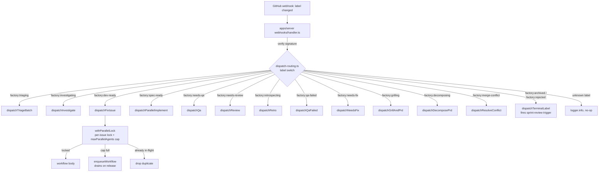
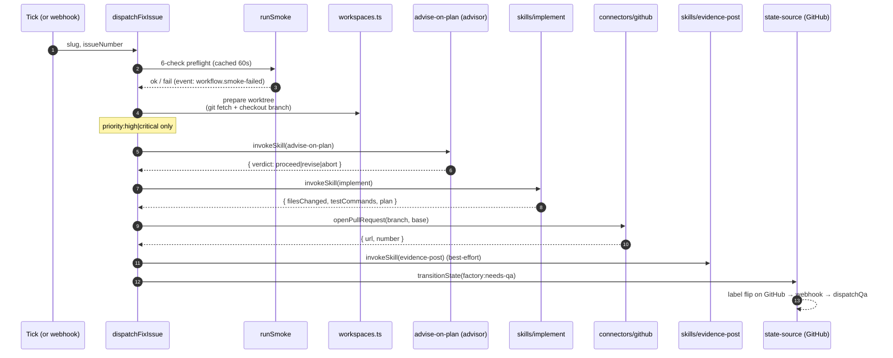
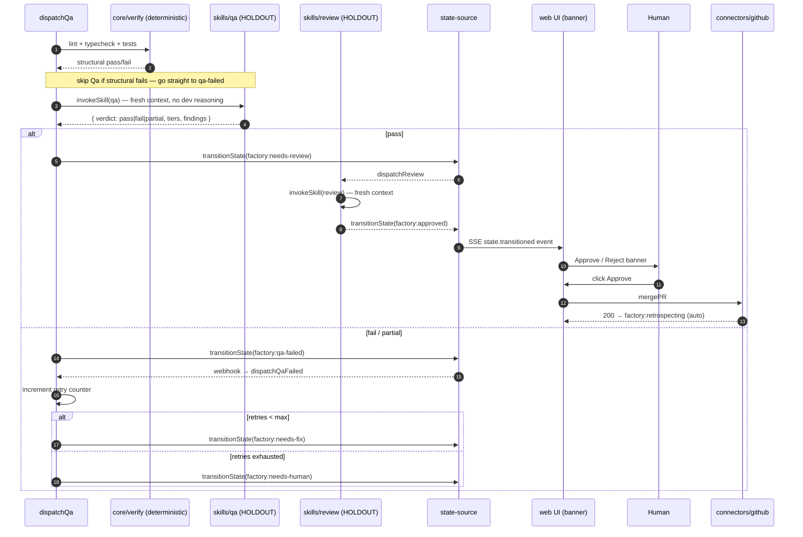
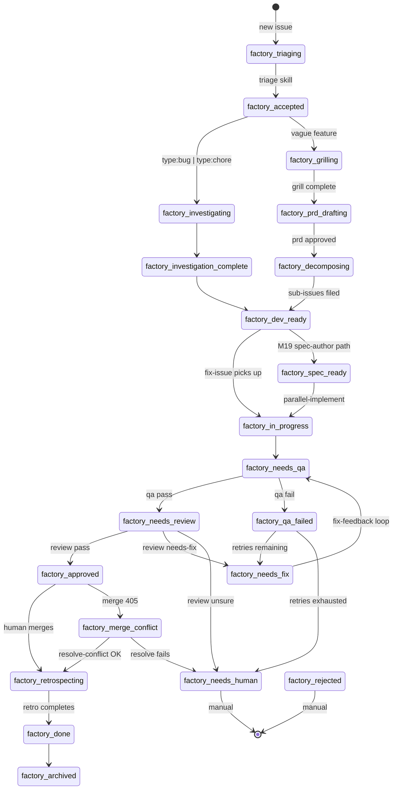
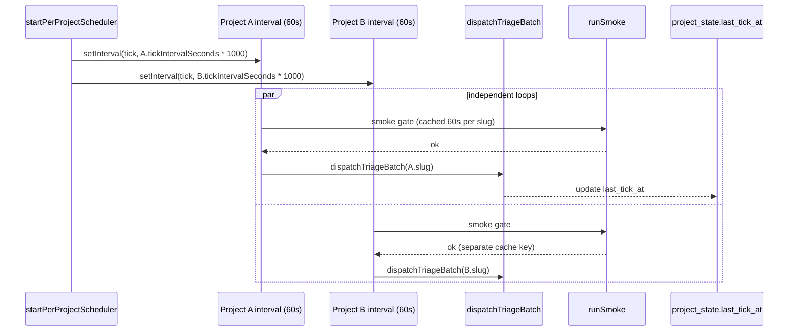
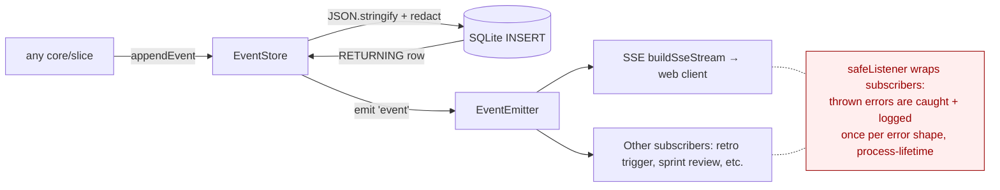
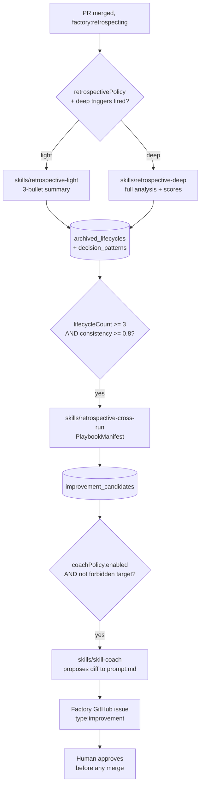

# Flows

Mermaid diagrams for the loops you actually care about.

## 1. Webhook → workflow dispatch

Key file: `apps/server/src/shared/dispatch-routing.ts:60` (`dispatchForLabel`).
Lock: `apps/server/src/shared/dispatch-lock.ts:58` (`withParallelLock`).

## 2. fix-issue workflow (the dev-side happy path)

Skipped here for compactness: dev-review (Codex pre-QA), parallel WP
builders (M19.03 path via `factory:spec-ready`), retry counters, and
budget gating. All happen between steps 5 and 7.

Key files: `slices/fix-issue/workflow.ts`, `apps/server/src/shared/dispatch-dev.ts`.

## 3. QA → Review → approval gate

Key files: `slices/qa/workflow.ts`, `slices/review/workflow.ts`,
`core/retry/retry-counter.ts`, `apps/server/src/domains/issues/transitions.ts`.

## 4. State machine (the happy path is just one slice of this)

Canonical: `core/state-machine/states.ts`, `transitions.ts`.
28 states; terminal: `done`, `archived`, `rejected`. Diagram omits a
couple of admin states for clarity.

## 5. Per-project tick scheduler

A crash in project A's tick does not stop project B. Each tick re-derives
state from GitHub + SQLite (rule 7: stateless across ticks).

Key files: `core/projects/scheduler.ts`, `core/orchestrator/smoke.ts`,
`apps/server/src/shared/dispatch.ts`.

## 6. Event store fan-out

`core/event-stream/store.ts:169` is the only writer.
`closeOrphanedRuns()` (line 300) runs on startup to emit synthetic
`agent.run-failed` for any `agent.run-started` without a matching
`run-completed` / `run-failed`.

## 7. Retro + learning loop (M9 + M11)

Forbidden coach targets are hard-coded: `qa`, `review`, all retros,
`skill-coach` itself. See ADR 0025.
