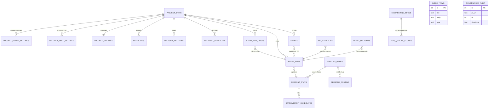

# Data model

`core/db/schema.ts` is the source of truth. This page is the
human-friendly summary.

## ER overview (selected tables)

> **Note.** SQLite FKs are not enforced at the database level (PRAGMA
> off — see Finding F-8). The diagram shows logical relationships; the
> code is the actual enforcer.

## Tables, in order of importance

| Table | Purpose | Hot read pattern | Indexes |
|---|---|---|---|
| `events` | Append-only audit log. Single writer. | `(projectId, workItemId, ?kind)` ascending by id | `(project_id, created_at)`, `(work_item_id, id)` — see F-9 |
| `project_state` | Per-project tick metadata, active milestone | by `project_id` | PK |
| `agent_runs` | One row per agent invocation, outcome only | by `run_id`, `project_id`, `persona_id` | runId uniq + 2 |
| `agent_run_costs` | One row per run, tokens + USD | by `project_id` over `created_at`; per `work_item_id` for issue page | runId uniq + 2 |
| `persona_stats` | Round-robin persona quality + run counts | `(persona_name, role)` for stats; by `role` for ranking | uniq on (name, role) — see F-9 |
| `persona_routing` | `lastIndex` for round-robin | `(project_id, role)` | composite PK |
| `persona_names` | Codename per (project, role, slot) | `(project_id, role, slot_index)` | uniq |
| `improvement_candidates` | Retro-flagged changes pending human approval | by `persona_name + status` | composite |
| `archived_lifecycles` | One JSON blob per closed work item | by `project_id` over `closed_at` | composite + (project, work_item) |
| `decision_patterns` | Mined convergent patterns (cross-run learning) | `(project_id, kind, role)` | uniq + project |
| `playbooks` | Exported PlaybookManifest snapshots | by `project_id` over `created_at` | composite |
| `run_quality_scores` | Per-run QualityScore (M19.08+) | by `pipeline_run_id`, `project_id` over `ts` | uniq + 2 |
| `engineering_specs` | EngineeringSpec JSON per work item (M19.17) | `(project_id, work_item_id)` | uniq |
| `wp_iterations` | Per-WP outcome rows (M19.03 parallel builder) | `(run_id, wp_id)` | uniq + 1 |
| `agent_decisions` | Decision capture (M19.06) | by `run_id` | uniq + 1 |
| `scout_reports` | Wave-1 scout JSON outputs | `(project_id, work_item_id, run_id)` | uniq + 1 |
| `governance_audit` | Per-PR governance check verdicts | by `pr_url` | PK only |
| `inbox_items` | Raw notes pending promotion to an issue | by id | PK |
| `project_settings`, `project_skill_settings`, `project_model_settings`, `project_dev_review_settings`, `project_review_settings` | Per-project settings; `project_skill_settings` owns normal skill runtime, `project_model_settings` is advanced compatibility state | by project | PKs |

## Two-place state split

| What | Where | Why |
|---|---|---|
| Work-item state, type, priority, schedule | GitHub Issue **labels** | Survives orchestrator crash; UI on github.com is the canonical view |
| Events, costs, persona stats, archives, audits | SQLite | Operational; regeneratable from events if needed |
| Project config (budgets, rolesModels, governance) | `target-projects/<slug>/project.config.ts` | Versioned in git; DB rows in `project_*_settings` are **overrides** on top |

This is rule 7: the orchestrator is stateless across ticks. The DB never
"owns" work-item state.

## Override precedence (model + budget resolution)

When `invokeSkill()` resolves a model and budget for a run:

1. **Caller override** (e.g. test seam, advisor wrapping) — wins.
2. **Forced runtime provider** from `agentConfig.runtime` (`codex-cli` / `claude-cli`) coerces provider.
3. **DB per-skill override** in `project_skill_settings`.
4. **`project.config.ts`** `budgets.skillBudgetOverrides[skill]`.
5. **`SKILL_BUDGETS` defaults** in `core/agent-runtime/budgets.ts`.

Normal dispatch does not read `project_model_settings`.

Code: `core/agent-runtime/skill-runtime-resolver.ts`.

Holdout protection: if `allowHoldoutOverride !== true`, any model/provider override
attempt against `qa` / `reviewer` is **silently dropped** (not errored), and
fallback/advisor models are not derived for holdouts.

## Migration story

- Drizzle migrations live in `core/db/migrations/`.
- `migrate()` runs on every server start (see `core/db/db.ts:54`).
  Idempotent (drizzle tracks applied migrations).
- Vitest workers each get their own DB file. The migration race is real
  if you ever try to share a DB across workers — `scripts/run-vitest-with-db.ts`
  is the workaround.

## Things deliberately NOT in the DB

- Work-item state (GitHub).
- Agent prompts (versioned files under `skills/`).
- Decision-summary text beyond the run window (archived only).
- Worktree contents (`~/.factory/workspaces/<runId>/`, ephemeral).
- Symbol index (`~/.factory/symbol-index.db`, regenerable, gitignored).
